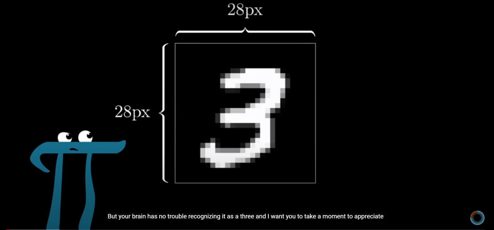
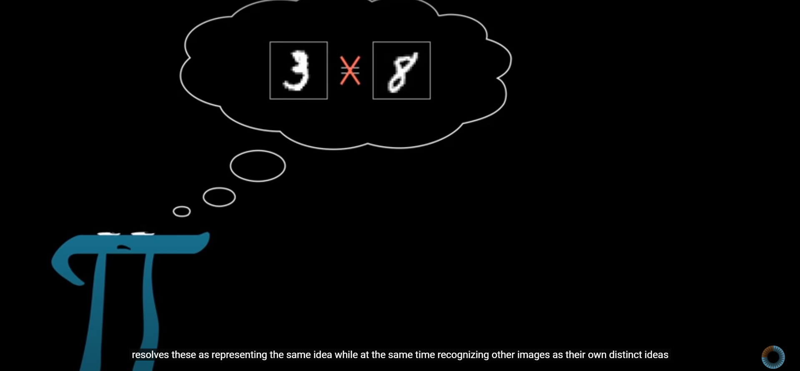
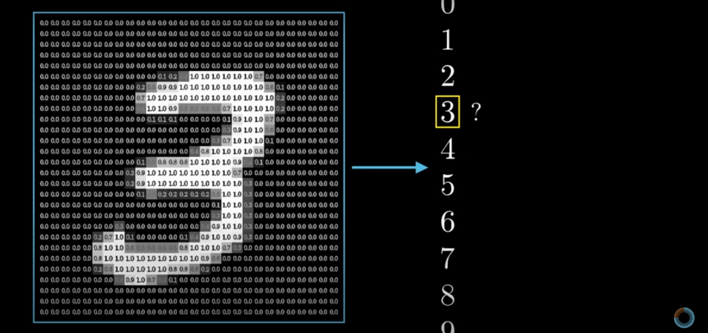
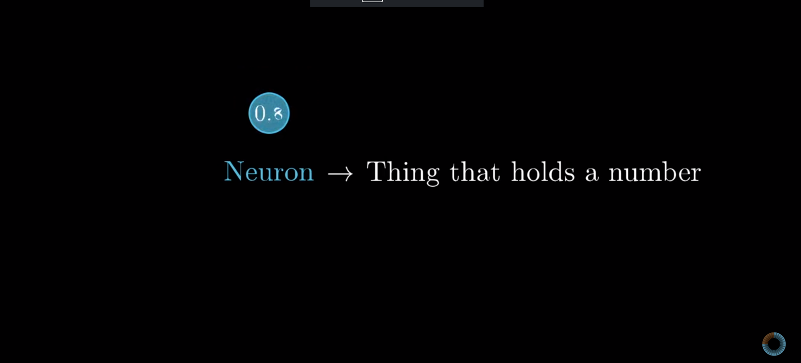
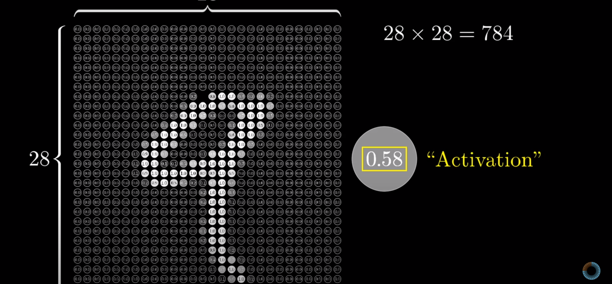
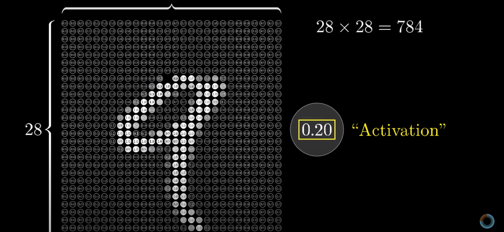
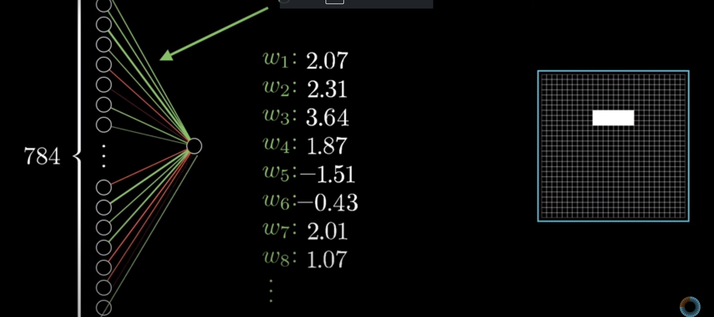

# Intro to Deep Learning 

### Background

**Why now ?**

**How now ?**

### Objectives

Learn the theory, background and intuitions of a neural network

To be able to train a neural network to achieve industrial quality results

Be industry ready for a deep learning position

Few classes of intense content

Need collaborative effort from each other

Post on Linkedin, medium

**Today we shall write a small piece of content about anything you learned from class today on Linkedin**

Quiz after session

### What we will be learning

1. What is Deep Learning and how is it different from machine learning
2. Theory of neural networks
3. Writing your first neural network
4. More complex neural networks
5. Training a neural network to reach industrial quality results on a popular dataset
6. Apply deep learning for NLP

### Some myths

Machine learning is not prerequisite for Deep Learning

Maths is compulsory for deep learning(Intuition is)

Need to do a lot of certifications online to be good at ML/DL

Need 1-2 years of preparation to be good at deep learning

Not possible for changing career paths in between

### What is machine learning

# Supervised Learning

### Classification

### What is Deep Learning

**Deep learning** (also known as **deep structured learning**) is part of a broader family of [machine learning](https://en.wikipedia.org/wiki/Machine_learning) methods based on [artificial neural networks](https://en.wikipedia.org/wiki/Artificial_neural_networks) with [representation learning](https://en.wikipedia.org/wiki/Representation_learning). Learning can be [supervised](https://en.wikipedia.org/wiki/Supervised_learning), [semi-supervised](https://en.wikipedia.org/wiki/Semi-supervised_learning) or [unsupervised](https://en.wikipedia.org/wiki/Unsupervised_learning).

Deep Learning uses neural networks to solve the same tasks as machine learning

# Machine Learning vs Deep Learning

Multiple ways to solve the same problem

### Applications of Deep Learning

https://www.youtube.com/watch?v=gLoI9hAX9dw

Dog vs cat classfier

**Object Detection**

Like mask detection

**Image Segmentation**

**Face detection**

**Prisma like apps**

**Generative networks**

**Speech Recognition**

## Neural Network and biological intuitions

 

**Basic components**

Neurons/Nodes

Weights

**What is an image ?**

Image is nothing but a matrix

Black and white image is a 2d matrix

RGB image is a 3d matrix

[1 3  6

9 2   9

0 34 89] -> [1 3 6 9 2 9 0 34 89]

300x300 -> 90000

Higher value of the number means higher the activation

**Artificial Neural Network**

Hierarchy :-

1. Input layer -> Determined by size of input
2. Hidden layers -> Hyperparameter to be tuned
3. Output layer -> Defined by target 