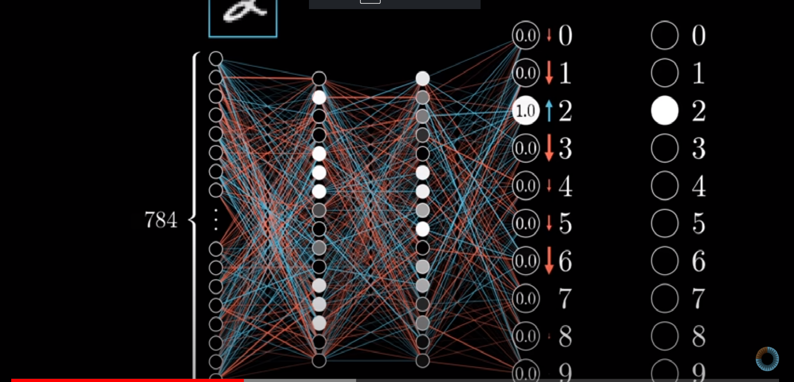
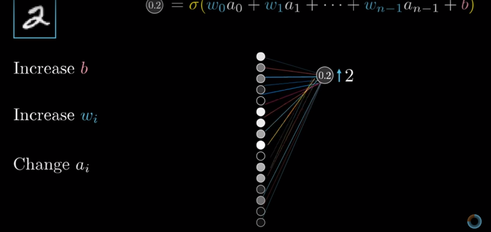

# Deep Dive into Neural Networks

### Agenda

Discussion about ANN and it's components

Feedforward neural network

Loss function 

Gradient Descent and Backpropagation

Hyperparameter discussion

Write our first ANN

## Neural Network 

https://www.youtube.com/watch?v=aircAruvnKk&list=PLZHQObOWTQDNU6R1_67000Dx_ZCJB-3pi

This is the basic structure of a neural network

Each circle represents a node

Each arrow represents a connection called weights which gives an idea how strong the connection is

Input nodes pass the input data

So if a dataset has n input features it will have n input nodes

F1, F2, F3, F4, F5 -> F6

So in case of a dataframe like this we will have 3 input nodes

Output nodes represent the number of values a target node can take

So it it's a iris classification problem we can have 4 outputs since there are 4 categories of iris

In between the input and output nodes there can be any number of layers with nodes called hidden layers. 

Input nodes and output nodes are fixed but the number of hidden layers and hidden nodes is a hyperparameter.

**Weights and bias**

0.5 x 0.7 + 1.3 x -0.4 = -0.17 + 0.03 = -0.14

**Multi-layered neural network**

**Activation Function**

Used to introduce non-linearity  

y = x1^2 + x2^3

Activation function does two things :-

1. Add non-linearity
2. Lights up or kills a neuron

**Softmax function**

S(2) = e^2/(e^2+e^1+e^0.1)

S(1) = e^1/(e^2+e^1+e^0.1)

S(0.1) = e^0.1/(e^2+e^1+e^0.1)

S(2) + S(1) + S(0.1) = 1

Linear -> MSE

Logistic -> Cross-Entropy

**Cross-entropy loss**

L = - ((0 * log(0.1)) + (1 * log(0.7) + (0 * log(0.2)))

Why cross-entropy and not mean square loss

**Gradient Descent**

Neural network does forward propagation to give a certain output

We then see how much the output differs from expect output using the cost/loss function

Our goal is to reduce the loss function and get the global minima using the weights and biases

To do this start with random set of weights and gradually nudge them to reach the local minima

https://www.youtube.com/watch?v=IHZwWFHWa-w&list=PLZHQObOWTQDNU6R1_67000Dx_ZCJB-3pi&index=2

**Backpropagation**

The output here vastly differs from expected

This is the output we want

To achieve this we need to push up the activation at 2 to 1 and push the rest down to 0

3 ways to change to output

1. Change bias
2. Change weights
3. Change activations

Cumulative sum of changes. Recursively apply the process and move backwards and hence backpropagation

https://www.youtube.com/watch?v=Ilg3gGewQ5U&list=PLZHQObOWTQDNU6R1_67000Dx_ZCJB-3pi&index=3

### Training concepts

**Batch**

Batch is a set of data points

**Learning rate**

Pace at which you would want to train

**Batch size and epoch**

Batch size is number of data points present in a single training step i.e iteration

An epoch is when all the examples in the training dataset is visited once

Difference between neural networks and other things you saw until now

Neural networks global minima might look like below, so you need to train more to reach global minima

If batch gd is used can get stuck in local minima hence mini batch gd is used

**Underfitting and overfitting**

Underfitting is battled by increasing the capacity of network

Overfitting is battled by adding regularisation techniques

**Input normalization**

Keep pixel values between 0-1

Divide every pixel value by 255

**Training and Test dataset**

We divide the dataset into train and test to validate if the model is not overfitting

### Dropout

**Dropout** is a regularisation technique which can be used to reduce overfitting

You can imagine Dropout as training multiple neural networks to do a task popularly called ensemble technique

Used to remove dependency on particular neurons

At test time all the neurons are used but the output is multiplied by a factor so as not to overwhelm

