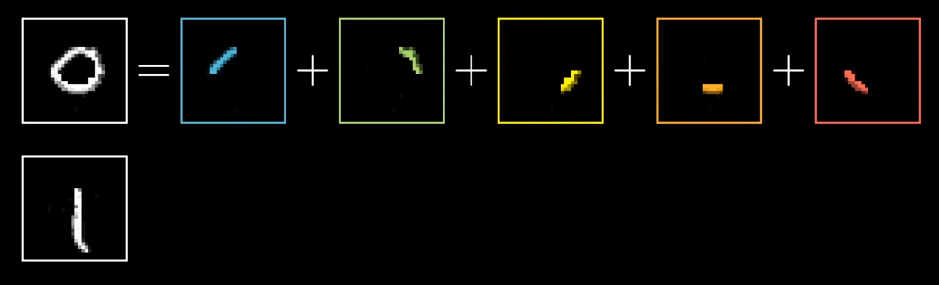

# Intro to CNN

### Agenda

Intro to CNN

CNN structural components discussion

Write first CNN

# Intro to CNN

What is lacking in ANN ?

It doesn't care about the contextual information present in 2d space hence there is no spatial information taken into account

[1 6 3
  4 7 2
  1 0 3]   -> [1 6 3 4 7 2 1 0 3] 

CNN solves the problem by using 2d filters which are learned 

https://youtu.be/aircAruvnKk?t=337

# Convolution

Convolution in neural nets is the operation of multiplying an input matrix such as an image with a kernel(another matrix) which is smaller in size than the input image. The multiplication is done one-on-one and the kernel is slided over the input to cover it entirely. It is done to extract important details from the input specific to the task 

CNN provides the capability of translation invariance.  So now we don't need to have weights at multiple locations to detect the same object

[1 2 3         [-1 0

 0 5 2    *    2  1]

 7 4 3]

1st element - > [1x-1+2x0+0x2+5x1] = 4

2nd element -> [2x-1+3x0+5x2+2x1] = 10

3rd element -> [0x-1+5x0+7x2+4x1] = 18

4th element -> [5x-1+2x0+4x2+3x1] = 6

[4  10

 18 6]

5x5 input when convolved with 3x3 filter gives output 3x3

n x n input when convolved with 3x3 filter gives output (n-2) x (n-2)

n x n -> n-2 x n-2 -> n-4 x n-4

n x n input when convolved with 5x5 filter gives output (n-4) x (n-4)

This output is called a feature map

The bigger the filter the bigger the spatial location from where the information is captured

Odd sized convolutions are preferred since they give even sized outputs

# Filters/Kernels

Filter/Kernel in a neural network refers to a matrix which is multiplied to input to obtain specific information. 

To the input a bunch of filters are applied each performing a different action and the information is passed on to the next layer. 

In older computer vision days the kernels are hand prepared but in neural networks backpropagation does the work for us.

CNN reduces the number of weights/parameters by sharing the filter across the network

The filters learn in the chronological order of Edges, Shapes, Textures, Parts of Objects, Objects

# 3x3 Convolution

3x3 Convolution is the standard convolution used in the latest neural network architectures. 

All major hardware are made efficient to run 3x3 convolutions hence using 3x3 convolutions provides an advantage. 

Any higher dimension convolution can be represented by multiple 3x3 convolution 

5x5 convolution can be thought of as same as two 3x3 convolutions performed consecutively.

n x n -> n-4 x n-4 

n x n -> n-2 x n-2 -> n-4 x n-4

7x7 convolution is same as three consecutive 3x3 convolutions

25 

9 , 9 -> 18

49

9, 9, 9 -> 27 

28 x 28 -> 26 x 26 x 10 -> 13 x 13 x10 -> 11 x 11 x 16 -> 5 x 5 x 16 -> 3x3x20  -> 180 

# Feature Maps

Output of neural network obtained after convolution with different kinds of kernels

# Padding

Padding is used to maintain same or required shape shape after convolution

# Stride

Stride is the number of pixels shifts over the input matrix. When the stride is 1 then we move the filters to 1 pixel at a time. When the stride is 2 then we move the filters to 2 pixels at a time and so on.

300 x 300 -> 298 x 298 -> 296 x 296 .......................       6x6

147 layers

300x300 -> 298x298 -> 149x149 -> 147x147 -> 145x145 -> 72x72 -> 70x70 -> 35x35 -> 33x33 -> 31x31 -> 15x15 -> 13x13 -> 6x6

28x28 * 3x3 -> 26x26 * 3x3 -> 24x24 

# Pooling

Pooling layers are similar to convolutional layers, but they perform a specific function such as max pooling, which takes the maximum value in a certain filter region, or average pooling, which takes the average value in a filter region. 

These are typically used to reduce the dimensionality of the network. 

Max Pooling picks up the most domination local information and ignores the others 

Pooling provides slight translational invariance as well

# Fully Connected Network

The layer we call as FC layer, we flattened our matrix into vector and feed it into a fully connected layer like neural network.

